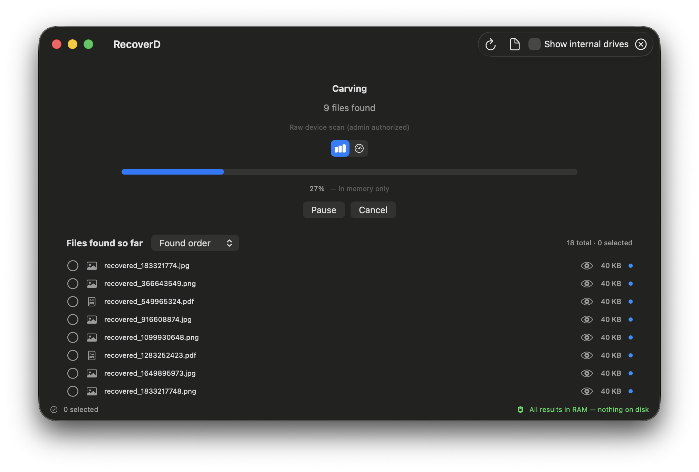

# RecoverD

[](LICENSE)
[](#deployment-target)
[](#highlights)
[](Package.swift)

> A secure, native macOS file-recovery tool for external storage, built for Apple Silicon.
> **Nothing leaves the source drive until *you* choose to save it.**

RecoverD scans USB thumb drives, SD cards, and external SSDs/HDDs for deleted files and
reformatted volumes, parses their file systems, and carves raw file content — **keeping all
results strictly in memory** until you explicitly export selected files to your Mac. This
"sandboxed recovery" workflow minimizes the risk of malicious files on the external media
being executed or persisted on the host.

<p align="center">
  
</p>

---

## Status

🚧 **Pre-release.** The core recovery workflow is implemented and tested end-to-end against fixture
images and real external devices:

- **File-system parsers**: **exFAT** (live + deleted-file recovery, FAT-chain extents, recursive
  directory walk), **FAT12/16/32** (BPB, FAT12/16/32 type detection, 8.3 + LFN decoding, `0xE5`
  deleted-entry recovery), and **NTFS** (MFT walk with update-sequence fixups, resident +
  non-resident `$DATA` data-run extents, `$FILE_NAME` parent-chain path resolution, and
  deleted-record recovery). When the OS doesn't label a volume, a boot-sector/superblock
  **content probe** routes it to the right parser. **APFS** and **HFS+** parsers are stubs (see
  [Next steps](#next-steps)).
- **Deep / carving scan** with a broad signature table: JPEG, PNG, GIF, PDF, ZIP, RIFF (AVI/WAV/
  WebP), MP3 (ID3 + raw frame sync), FLAC, Ogg, ISO-BMFF (MP4/MOV/M4A/HEIC), Matroska/WebM, MPEG
  program stream, TIFF, and camera RAW (ORF, RW2, Fujifilm RAF, Sigma X3F, Canon CR2/CR3, plus
  NEF/ARW/DNG via the TIFF path). Container formats are **sized from their headers** (IFDs, EBML
  Segment size, RIFF/ISO-BMFF box chains, RAF header directory) rather than capped. "Try harder"
  and "Include RAW" toggles trade recall for precision/speed.
- **Content sniffing** (`FileTypeSniffer`) identifies files by their bytes when the name/extension
  is missing or misleading, plus an in-app "Identify file type" action in the preview.
- **In-app previews**: photo, video (streamed via an in-memory AVFoundation resource loader), PDF,
  and text — all rendered from RAM.
- **No-copy raw device reads** via `authopen` + `pread` (one admin prompt per session) — the device
  is never imaged to `/tmp` or fully buffered. A session-level read cache is shared by the scan,
  previews, and export.
- **Quick + Deep scan**, **pause/resume/cancel**, progress reporting, results sorting (size/name/
  type), low-confidence carve flagging, and a clear "in RAM vs. on disk" indicator.
- **Secure wipe** of all in-memory recovery data on clear/quit.

Not yet built: the APFS (`libfsapfs`) and HFS+ parsers, the sandboxed `SMAppService` privileged
helper (the current raw path uses `authopen` and a non-sandboxed GUI — see [Raw disk
access](#raw-disk-access-on-macos-read-this)), the Xcode app-project wrapper / signing /
notarization, and security-scoped bookmarks for the export destination.

---

## Why the name?

**RecoverD** = *Recover* + **D**rive / **D**evice. It reads as a daemon-style name (the `d`
suffix echoes macOS conventions like `diskarbitrationd`, `locationd`), which suits a tool that
pairs a privileged low-level engine with a SwiftUI UI. Keep as-is.

---

## Highlights

- **Apple Silicon only** (arm64 / M-series). No Intel, no Rosetta.
- **macOS 14 Sonoma+** (see [Deployment target](#deployment-target)).
- **Swift 6** language mode with strict concurrency; SwiftUI-first, AppKit only where needed.
- **In-memory sandbox**: metadata, thumbnails, and previews live in RAM and are securely wiped
  on clear/quit. File *contents* are never written to disk without an explicit Save.
- **Quick scan** (file-system metadata) and **Deep / carving scan** (reformatted/corrupted media).
- **File-system parsing**: **exFAT, FAT12/16/32, and NTFS implemented**; APFS (via `libfsapfs`
  bridging) and HFS+ planned.
- **Signature carving** of JPEG, PNG, GIF, PDF, ZIP, RIFF, MP3, FLAC, Ogg, MP4/MOV/M4A/HEIC,
  Matroska/WebM, MPEG, TIFF, and camera RAW — header-sized where possible, with "Try harder" and
  "Include RAW" toggles.
- **Content sniffing** that types files by their bytes when the name/extension is wrong or missing.
- **In-app previews** for photos, video, PDF, and text — streamed from RAM, never written to disk.
- **No-copy raw device reads** (`authopen` + `pread`, one admin prompt) — the source drive is never
  imaged to your Mac. Image-file (`.dmg`/raw) scanning needs no privilege at all.
- **Pause/resume/cancel**, progress reporting, results sorting, low-confidence carve flagging, and a
  clear "in RAM vs. on disk" indicator.
- **Swift Package Manager** layout; openable in Xcode (`xed .`) or buildable from the CLI.

---

## Security model (the non-negotiable part)

1. **Scan → Review → Export.** Scanning produces *in-memory* results only.
2. **No automatic writes** of recovered content to the Mac during scanning or previewing.
3. **On-demand previews/thumbnails** are generated in RAM and discarded when no longer needed.
4. **Explicit export** is the *only* path that writes recovered file bytes to the Mac, to a
   user-chosen destination.
5. **Secure wipe** of all in-memory recovery data on clear or quit.
6. **Hardened runtime + notarization-ready**. Raw block access today goes through `authopen`
   (one admin prompt) with a non-sandboxed GUI; the planned end state is a sandboxed GUI plus a
   privileged `SMAppService` helper daemon (see [Raw disk access](#raw-disk-access-on-macos-read-this)).

See [`docs/SECURITY.md`](docs/SECURITY.md) for the full threat model and
[`docs/ARCHITECTURE.md`](docs/ARCHITECTURE.md) for the in-memory sandboxing flow.

---

## Deployment target

**macOS 14 Sonoma** is the minimum. Rationale:

- The **`@Observable` macro** (Observation framework) requires macOS 14 and drives the UI layer.
- **Modern Swift Concurrency** (strict Swift 6, `SMAppService`-based privileged helpers) is mature.
- **`SMAppService`** (macOS 13+) is the supported path for a privileged helper daemon for raw
  disk access; macOS 14 gives it a year of stability.
- Apple Silicon shipped with macOS 11; requiring macOS 14 keeps us on actively-supported OS
  versions and drops legacy Intel-era APIs we'd otherwise carry.

---

## Repository layout

```
RecoverD/
├── Package.swift                  # SPM manifest (Swift 6, macOS 14+)
├── README.md                      # this file
├── CONTRIBUTING.md                # how to contribute + pre-PR quality gates
├── SECURITY.md                    # how to report a vulnerability (→ docs/SECURITY.md)
├── PRIVACY.md                     # what RecoverD does (and doesn't) collect
├── NOTICE                         # copyright + third-party notices
├── LICENSE                        # Apache 2.0
├── AGENTS.md                      # build/test commands + conventions for AI tooling
├── .gitignore
├── .github/                       # CI workflow, issue/PR templates, dependabot
├── docs/
│   ├── ARCHITECTURE.md            # layering + in-memory sandbox (Mermaid)
│   └── SECURITY.md                # full threat model, raw-disk access, entitlements
├── Resources/
│   ├── Info.plist                 # app bundle metadata (for Xcode wrapper)
│   ├── Entitlements.app.plist     # sandboxed GUI entitlements (target state)
│   ├── Entitlements.helper.plist  # non-sandboxed privileged helper entitlements
│   ├── AppIcon.icns               # app icon
│   └── AppIcon-source-1024.png
├── Sources/
│   ├── RecoverDApp/               # @main SwiftUI app (executable target)
│   │   ├── RecoverDApp.swift      #   App + quit-wipe delegate
│   │   ├── ContentView.swift
│   │   ├── Views/                 # device picker, scan progress, result browser,
│   │   │                          # preview (photo/video/PDF/text), export
│   │   ├── ViewModels/            # @Observable RecoverySessionViewModel
│   │   └── Support/               # InMemoryAssetLoader (streamed AVFoundation preview)
│   ├── RecoverDCore/              # shared, dependency-free types (library)
│   │   ├── Models/                # DeviceInfo, RecoverableFile, ScanResult, ByteRange
│   │   └── Security/              # SecureData (zeroed-on-free byte buffer)
│   └── RecoverDEngine/            # recovery engine (library — no SwiftUI/AppKit)
│       ├── Devices/               # discovery, RawBlockReader, URLBlockReader,
│       │                          # PrivilegedRawDevice (authopen) + RawFDReader (pread),
│       │                          # CachingBlockReader, MountedFileReader, PrivilegedDiskAccess
│       │                          # (XPC helper protocol scaffold)
│       ├── Filesystems/           # parser protocol + exFAT/FAT12-16-32/NTFS (implemented),
│       │                          # APFS/HFS+ stubs
│       ├── Carving/               # FileCarver (signature table) + FileTypeSniffer
│       ├── Scanning/              # ScanEngine actor + MountedVolumeScanner
│       ├── Support/               # content readers, errors, FS helpers
│       └── Export/                # ExportManager (the only content write path)
└── Tests/
    ├── RecoverDCoreTests/
    └── RecoverDEngineTests/
```

---

## Build & run

```bash
swift build                  # build all targets (debug)
swift test                   # run unit tests
swift run RecoverDApp        # launch the GUI (CLI-built; see note below)
```

Open in Xcode:

```bash
xed .                        # opens the Swift Package in Xcode
```

> **Note on bundling:** `swift build` compiles and runs the SwiftUI app. To produce a signed,
> notarized, distributable `.app` (packaged as a `.dmg`/`.zip`), run
> [`Scripts/release.sh`](Scripts/release.sh) — it builds the binary, assembles the bundle, signs
> with Developer ID + hardened runtime, notarizes, staples, and checksums. It degrades to an
> ad-hoc build when no signing identity is set. See [`docs/RELEASING.md`](docs/RELEASING.md).

---

## Raw disk access on macOS (read this)

Reading `/dev/disk*` / `/dev/rdisk*` requires privileges that **App Sandbox forbids**. RecoverD
handles this in two stages:

**Today (current build):** the GUI obtains a read-only file descriptor to `/dev/rdisk*` via
`authopen` — macOS's standard admin-authorization helper — which hands the open descriptor back
over a Unix-domain socket (`SCM_RIGHTS`) after one admin prompt. Reads then use `pread` straight
into wiped `SecureData`, so the device is **never copied to your Mac's storage** and never fully
buffered in memory. This path requires the GUI to run **non-sandboxed** (which the `swift run` CLI
build does); the `Resources/Entitlements.app.plist` sandbox setting is the *target* for the helper
world below, not the current runtime posture.

**Planned (hardening target):** a sandboxed GUI plus a **privileged helper daemon** registered via
`SMAppService` (macOS 13+) — non-sandboxed, hardened, performing raw block reads over XPC. This
restores a sandboxed GUI. `Sources/RecoverDEngine/Devices/PrivilegedDiskAccess.swift` holds the
`@objc` XPC protocol scaffold for this; wiring `SMAppService.daemon(plistName:)` + `NSXPCListener`
is a tracked next step.

The engine is abstracted behind `RawBlockReader` so it works identically against:

- a `.dmg`/raw **image file** — `URLBlockReader` (local `FileHandle`, no privilege needed; great
  for tests), and
- a **real device** — `RawFDReader` over an `authopen` descriptor today (helper-backed XPC reader
  once the daemon lands).

See `Sources/RecoverDEngine/Devices/BlockDeviceReader.swift` (`RawBlockReader` + `URLBlockReader`),
`Sources/RecoverDEngine/Devices/PrivilegedRawDevice.swift` (`authopen` fd passing),
`Sources/RecoverDEngine/Devices/RawFDReader.swift` (block-aligned `pread`), and
`Sources/RecoverDEngine/Devices/PrivilegedDiskAccess.swift` (the XPC helper scaffold).

---

## Next steps

1. **`libfsapfs` bridge** (SwiftPM binary target or system-library wrapper) so `APFSParser`
   enumerates live + deleted files instead of returning empty.
3. **Basic HFS+** parser (catalog B-tree); validate against fixture images.
4. **Sandboxed GUI + `SMAppService` privileged helper** (XPC `RawBlockReader` against
   `/dev/rdisk*`), replacing the current `authopen` path so the GUI can run sandboxed.
5. **Security-scoped bookmarks** for the export destination (re-access across launches).
6. **Scan-position checkpointing** (pause/resume already works; checkpointing *position only* —
   never content — would let long scans survive an app restart).
7. **`MemoryHygiene` service** that registers every `SecureData` holder for deterministic
   zero-on-quit (today's quit-wipe is best-effort).
8. **Carving refinements**: footer/structure-based sizing for the remaining best-guess formats
   (GIF/ZIP/MP3/FLAC/Ogg/MPEG), plus more signatures.

Already landed: exFAT + FAT12/16/32 + NTFS parsing, the Developer ID signing + notarization +
packaging pipeline (`Scripts/release.sh` + the `Release` workflow), signature carving for the
formats listed in
[Highlights](#highlights), content sniffing, in-app previews, no-copy `authopen` raw reads, the
session read cache, pause/resume/cancel, results sorting, and low-confidence carve flagging.

---

## Contributing

Contributions welcome — see [`CONTRIBUTING.md`](CONTRIBUTING.md) for build/test commands, the
pre-PR quality gates, and the conventions (security model, engine/UI split, no comments). By
contributing you agree your contributions are licensed under the Apache 2.0 license. Please open
an issue first for non-trivial changes. To report a security issue, see [`SECURITY.md`](SECURITY.md).

## License

Apache License 2.0 — see [`LICENSE`](LICENSE) and [`NOTICE`](NOTICE).
