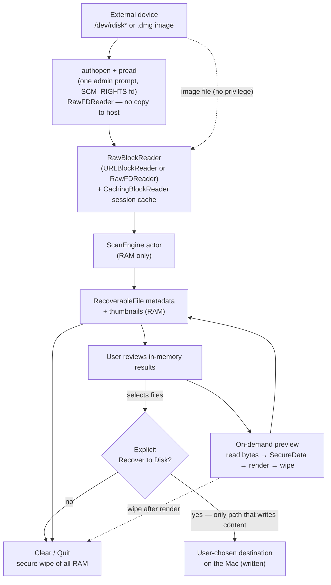

# RecoverD Architecture

Native macOS (Apple Silicon, macOS 14+) file-recovery tool. Swift 6 strict concurrency.
SwiftUI-first UI; AppKit only where SwiftUI is insufficient (file panels, thumbnail rendering).

## Layers

```
┌─────────────────────────────────────────────────────────────────────┐
│ RecoverDApp  (executable target — SwiftUI + AppKit)                  │
│   RecoverDApp (@main App + quit-wipe delegate) · ContentView         │
│   Views: DevicePicker · ScanProgress · ResultBrowser · Preview       │
│          (Photo/Video/PDF/Text) · Export                              │
│   ViewModels: RecoverySessionViewModel (@Observable, @MainActor)     │
│   Support: InMemoryAssetLoader (streamed AVFoundation preview)       │
└───────────────────────────────▲──────────────────────────────────────┘
                                │  async calls + AsyncStream<ScanProgress>
                                │  (metadata + thumbnails only; never content on disk)
┌───────────────────────────────┴──────────────────────────────────────┐
│ RecoverDEngine  (library target — UI-agnostic, no SwiftUI/AppKit)     │
│   Devices:  DeviceDiscovery · RawBlockReader · URLBlockReader         │
│             PrivilegedRawDevice (authopen fd) · RawFDReader (pread)   │
│             CachingBlockReader · MountedFileReader                    │
│             PrivilegedDiskAccess (XPC helper protocol — scaffold)     │
│   Filesystems: FilesystemParser + exFAT/FAT12-16-32 (impl)            │
│                APFS/HFS+ (stubs; APFS→libfsapfs)                      │
│   Carving:   FileCarver · SignatureFileCarver · FileTypeSniffer       │
│   Scanning:  ScanEngine (actor) + MountedVolumeScanner — own state    │
│   Support:   ContentReader · FileContentReader · Errors · FS helpers  │
│   Export:    ExportManager (explicit user write — the only content    │
│              path that writes to the Mac)                             │
└───────────────────────────────▲──────────────────────────────────────┘
                                │  uses
┌───────────────────────────────┴──────────────────────────────────────┐
│ RecoverDCore  (library target — dependency-free shared types)         │
│   Models:   DeviceInfo · RecoverableFile · ScanResult · ScanProgress  │
│             ByteRange                                                  │
│   Security: SecureData (zeroed-on-free byte buffer)                   │
└──────────────────────────────────────────────────────────────────────┘
```

## Data-flow: the in-memory sandbox

The defining rule: **scanning and previewing never write recovered content to the Mac.** Only
the explicit Export ("Recover to Disk") action writes, and only to a user-chosen destination.
The source device is never imaged or copied to the host.



## Concurrency model

- `ScanEngine` is an `actor` — the single owner of mutable recovery state (the live
  `RecoverableFile` array, progress, reader). Swift 6 guarantees no data races.
- Model types in `RecoverDCore` are `Sendable` value types (`struct`/`enum`).
- Transient *content* flows through `SecureData` (`@unchecked Sendable`, lock-protected,
  zeroed on free).
- The UI talks to the engine via `AsyncStream<ScanProgress>` and immutable `ScanResult`
  snapshots — it never pokes mutable engine state directly.
- `RecoverySessionViewModel` is `@MainActor @Observable`, bridging async engine updates into
  SwiftUI-reactive properties.

## The single write path

`ExportManager` is the **only** code that writes recovered content to the Mac, and it runs
**only** as an explicit user action:

- The user multi-selects files in the result browser and clicks **Recover to Disk**, then
  picks a destination folder.
- Each file's bytes are read on demand into `SecureData`, written to the chosen destination,
  and the `SecureData` is wiped immediately after.

Nothing is written during scanning or previewing, and the source device is never imaged or
copied to the host. This preserves the security invariant while still being a usable recovery
tool. (An earlier `DiskImager` "byte-for-byte copy" path was removed precisely because it wrote
device contents to the host outside this single, explicit export.)

## Engine ↔ raw access abstraction

`RawBlockReader` decouples the engine from *how* bytes are obtained:

| Source                       | Implementation                        | Privilege?        |
|------------------------------|---------------------------------------|-------------------|
| `.dmg` / raw image file      | `URLBlockReader` (local `FileHandle`) | None              |
| Real external `/dev/rdisk*`  | `RawFDReader` over an `authopen` fd   | One admin prompt  |

All reads pass through `CachingBlockReader` — a block-aligned, request-coalescing, FIFO-evicted
session cache shared by the scan, previews, and export — so a previewed or exported file is
usually served from RAM without re-reading the device.

This makes the entire engine exercisable in tests against fixture images. The *planned* hardening
target swaps the `authopen` path for an `SMAppService` privileged helper performing raw reads over
XPC (`PrivilegedDiskAccess.swift` is the scaffold); the engine is unchanged either way, and the
helper can be developed independently.

## Extension points (next steps)

1. `libfsapfs` bridge behind `APFSParser` (binary target + C module map).
2. Basic `HFSPlusParser` (catalog B-tree).
3. Replace the helper-stub `PrivilegedDiskAccess` with a real `SMAppService` daemon + `NSXPCListener`.
4. Security-scoped bookmarks for the export destination (re-access across launches).
5. A `MemoryHygiene` service that registers every `SecureData` holder for deterministic
   zero-on-quit.

### exFAT parser (implemented)

`EXFATParser` reads the Main Boot Sector (volume parameters at fixed offsets), the FAT (uint32
cluster entries, EOC `>= 0xFFFFFFF8`), and walks the root directory cluster chain recursively
(with a visited-cluster cycle guard). Each file is an entry set: a File entry (`0x85` live /
`0x05` deleted — the InUse bit `0x80` is the deleted flag) + a Stream Extension (`0x86`/`0x06`)
+ one or more File Name entries (`0x81`/`0x01`, 15 UTF-16 chars each). Live files get their FAT
chain walked into accurate `extents` (`ByteRange` per cluster, final run trimmed to `DataLength`);
deleted files (chain freed) fall back to a contiguous heuristic at the first cluster. FAT
timestamps decode to UTC `Date`s. Directories are traversed but not listed as recoverable files.

### FAT12/16/32 parser (implemented)

`FAT32Parser` handles all three FAT variants despite the name. It reads the BIOS Parameter Block
(BPB) from the boot sector, determines the FAT type (12/16/32-bit) from the FAT size field and
cluster count, reads the FAT, and walks the root directory — a fixed region after the FAT for
FAT12/16, or a cluster chain starting at `rootCluster` for FAT32. Directory entries are 32 bytes:
8.3 entries (name + ext + attr + cluster + size + timestamps) and LFN entries (attr `0x0F`,
13 UTF-16 chars each, preceding their 8.3 entry in reverse ordinal order, validated by checksum).
Live files get their FAT chain walked into accurate `extents`; deleted files (first byte `0xE5`)
recover name (first char replaced with `_`), size, and first cluster from the 8.3 entry, with the
FAT chain freed so `extents` is nil (contiguous heuristic). FAT12's packed 12-bit entries are
decoded correctly (odd/even cluster offset). Subdirectories are traversed recursively with a
visited-cluster cycle guard. NT case-info bits (lowercase name/extension) are honored.
